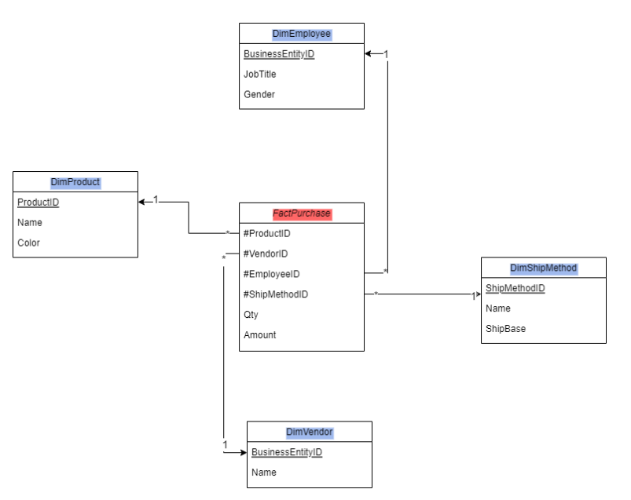

# 🚀 AdventureWorks2022 ETL to Data Warehouse using SSIS

## 📌 Project Overview

This project demonstrates the design and implementation of a complete ETL (Extract, Transform, Load) pipeline using **SQL Server Integration Services (SSIS)**. The solution extracts purchasing data from the **AdventureWorks2022** transactional database, performs data cleansing and transformation, and loads the processed data into a dedicated **Data Warehouse** for reporting and analytics.

The project follows a dimensional modeling approach and creates Fact and Dimension tables to support Business Intelligence and Dashboarding solutions.

---

## 🏗️ Data Warehouse Architecture



---

## 🎯 Objectives

* Extract purchasing data from AdventureWorks2022 database.
* Transform and clean data using SSIS Data Flow Tasks.
* Load data into a centralized Data Warehouse.
* Implement a Star Schema for analytical reporting.
* Enable efficient Business Intelligence and Dashboard creation.

---

## ⚙️ Technologies Used

* SQL Server 2022
* SQL Server Integration Services (SSIS)
* SQL Server Management Studio (SSMS)
* Visual Studio / SQL Server Data Tools (SSDT)
* AdventureWorks2022 Database

---

## 📊 Data Warehouse Design

### Fact Table

#### FactPurchase

Stores key purchasing transaction metrics including:

* Purchase Order ID
* Product Information
* Vendor Details
* Employee Information
* Order Quantity
* Unit Price
* Total Cost
* Order Date

### Dimension Tables

#### DimEmployee

Contains employee-related information.

#### DimProduct

Contains product details and attributes.

#### DimVendor

Stores vendor and supplier information.

#### DimShipMethod

Contains shipping method details.

---

## 🔄 ETL Process Flow

### 1. Extract

* Extract purchase-related data from AdventureWorks2022 database.
* Retrieve data from source tables such as:

  * PurchaseOrderHeader
  * PurchaseOrderDetail
  * Product
  * Vendor
  * Employee
  * ShipMethod

### 2. Transform

* Clean and validate source data.
* Handle null values and inconsistencies.
* Generate surrogate keys.
* Apply business rules and transformations.

### 3. Load

* Load Dimension tables first.
* Load FactPurchase table after dimension population.
* Maintain referential integrity within the warehouse.

---

## 📂 Project Structure

```text
AdventureWorks2022-ETL-to-Data-Warehouse/
│
├── images/
│   └── Star.PNG
│
├── Documentation.pdf
│
├── miniProj/
│   ├── SSIS Packages
│   ├── SQL Scripts
│   └── Solution Files
│
└── README.md
```

---

## 🚀 Setup Instructions

### Prerequisites

Before running the project, install:

* SQL Server
* AdventureWorks2022 Database
* SQL Server Integration Services (SSIS)
* SQL Server Data Tools (SSDT)
* Visual Studio

### Installation Steps

1. Clone the repository

```bash
git clone https://github.com/vishalchavare/-AdventureWorks2022-ETL-to-Data-Warehouse.git
```

2. Open the SSIS Solution in Visual Studio.

3. Configure SQL Server connection managers.

4. Verify database credentials.

5. Execute the SSIS packages.

---

## 📈 Expected Outcome

After successful execution:

* Data is loaded into the Data Warehouse.
* Fact and Dimension tables are populated.
* Data becomes ready for Power BI, Tableau, or SSRS reporting.
* Analytical dashboards can be created for purchasing insights.

---

## 📚 Documentation

Detailed project documentation is available in:

```text
Documentation.pdf
```

The document contains:

* Data Warehouse Design
* ETL Workflow
* Database Schema
* Implementation Details
* Screenshots and Results

---

## 👨‍💻 Author

**Vishal Chavare**

Computer Engineering Graduate | Data Engineering Enthusiast | Full Stack Developer

📧 Email: [vishalchavare04@gmail.com](mailto:vishalchavare04@gmail.com)

🔗 LinkedIn: https://www.linkedin.com/in/vishal-chavare/

🌐 GitHub: https://github.com/vishalchavare

---

⭐ If you found this project useful, don't forget to star the repository.
